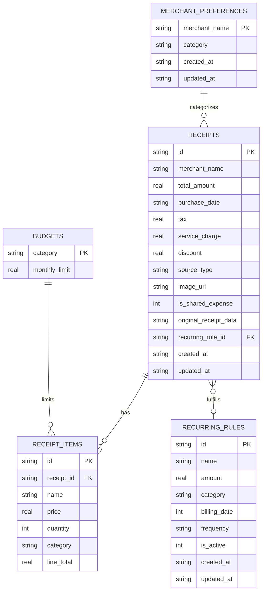

# NOTA — Complete Application & Technical Architecture Report

**Version:** 1.0.0  
**Repository:** [darylrafael/NOTA](https://github.com/darylrafael/NOTA)  
**Last Updated:** September 2026  

---

## Executive Summary

**NOTA** is a minimal, iOS-native, local-first personal finance application engineered for effortless expense tracking in Indonesia. Designed as a **calm financial journal** rather than a dense, noisy fintech dashboard, NOTA combines AI-powered computer vision and NLP with a local SQLite database and deterministic financial math.

* **Core Philosophy:** Local-First, Zero-Clutter, Explainable Math, Tactile Polish.
* **Target Currency & Market:** Indonesian Rupiah (IDR), Indonesian physical receipts, thermal paper receipts, QRIS transactions, bank transfer proofs, and local merchant naming conventions.

---

## 1. Information Architecture & Navigation

NOTA organizes user finances into distinct mental models:

```
┌─────────────────────────────────────────────────────────────┐
│                      NOTA ECOSYSTEM                         │
├──────────────┬──────────────┬───────────────┬───────────────┤
│     HOME     │     SCAN     │   INSIGHTS    │    HISTORY    │
│ "What is     │ "Capture a   │ "Understand   │ "Inspect the  │
│  happening    │  transaction │  spending     │  ledger &     │
│  now?"       │  in seconds" │  patterns"    │  line items"  │
└──────┬───────┴──────┬───────┴───────┬───────┴───────┬───────┘
       │              │               │               │
       ▼              ▼               ▼               ▼
 ┌───────────┐  ┌───────────┐   ┌───────────┐   ┌───────────┐
 │ Recurring │  │ NLP Quick │   │ Top Merch │   │ Search &  │
 │ Bills     │  │ Add (Type)│   │ Analytics │   │ Filter    │
 └───────────┘  └───────────┘   └───────────┘   └───────────┘
 ┌───────────┐  ┌───────────┐   ┌───────────┐   ┌───────────┐
 │ Price     │  │ Split     │   │ Month in  │   │ Receipt   │
 │ Book      │  │ Bill      │   │ Review    │   │ Detail    │
 └───────────┘  └───────────┘   └───────────┘   └───────────┘
 ┌───────────┐  ┌───────────┐   ┌───────────┐   ┌───────────┐
 │ Review    │  │ Category  │   │ Forecast  │   │ Budget    │
 │ Queue     │  │ Learning  │   │ Engine    │   │ Limits    │
 └───────────┘  └───────────┘   └───────────┘   └───────────┘
```

---

## 2. Complete Feature Inventory

### 🟢 Core Surfaces (Bottom Tab Navigation)

#### 1. Home (`app/(tabs)/index.tsx`)
* **Spending Overview:** Displays current-month total spent with an animated counter (`AnimatedNumber`), category distribution stacked bar, and date-range filters (This Month, All Time, Custom).
* **Recent Activity:** Displays the 5 most recent transactions with categorized color accents, line item counts, and quick drill-down.
* **Upcoming Bills Preview:** Shows pending or overdue recurring obligations directly on Home with "Mark as Paid" actions.
* **Quick Actions Grid:** 1-tap entry points to **History**, **Recurring Bills**, **Price Book**, and **Review Queue**.
* **Smart Search:** Real-time debounced transaction search across merchants and item names.

#### 2. Scan & Ingestion (`app/(tabs)/scan.tsx`)
* **Dual Ingestion Modes:**
  * **Camera & Gallery OCR:** Captures physical receipts, thermal slips, and digital payment screenshots (GoPay, OVO, ShopeePay, BCA/Mandiri transfers, QRIS).
  * **Quick Add / NLP ("Type"):** Natural Language Parser that parses informal Indonesian text (e.g. *"Makan sate padang 25rb sama es teh 5rb pake gopay"*) into structured line items, categories, and totals without an image.
* **Extraction Processing:** Visual feedback animation (*Sparkles*, dynamic step status) while maintaining low latency.
* **Confirmation & Editing (`app/confirm.tsx`):** Pre-save verification screen to edit merchant name, date, tax, service charge, discounts, and item-by-item categories before SQLite persistence.

#### 3. Insights (`app/(tabs)/insights.tsx`)
* **Calendar Month Navigator:** Interactive `< Month Year >` switcher with future-month guarding and modal month picker.
* **Hero Financial Position:** Big-number total spent, Month-over-Month (MoM) semantic delta (e.g., `↑ Rp450.000 vs July`), and transaction volume.
* **Month in One Line:** Contextual editorial spending commentary (e.g., *"Most of your spending went to Food & Drink (43% of total expenses)"*).
* **Top Merchants Segment:**
  * **By Spending:** Highlights top 5 merchants by gross money spent.
  * **By Frequency:** Highlights habit-forming merchants by visit counts and average spent per transaction.
* **2-Row Category Progress Stack:** Full-width progress bars displaying category proportions and exact amounts.
* **Forecast Engine:** Linear projection estimating month-end burn rate based on current pacing.

---

### 🔵 Secondary Screens & Deep-Dive Modules

#### 4. Transaction History (`app/history.tsx`)
* Dedicated ledger accessed via "See All" from Home.
* Month-scoped search and category pill filters.
* Grouped by date (**TODAY**, **YESTERDAY**, **DD MMM YYYY**).

#### 5. Merchant Intelligence (`app/merchant/[name].tsx` & `rules.tsx`)
* Aggregates total expenditure, total visits, and average ticket size for any merchant.
* Chronological transaction list specific to that merchant.
* **Merchant Category Learning:** Saves user-preferred categories for merchants to auto-categorize future receipts.

#### 6. Month in Review (`app/review/[month].tsx`)
* A retrospective recap screen triggered at the end of a month.
* Features editorial narrative insights: *Top Merchant*, *Most Frequent Merchant*, *Biggest Single Expense*, and *Category Breakdown*.
* Interactive elements enable drill-down into underlying receipts.

#### 7. Recurring Bills & Subscriptions (`app/recurring/index.tsx`)
* **Active Rules Management:** Supports monthly and weekly recurring schedules (e.g. Netflix, Wi-Fi, electricity, rent).
* **AI Recurring Suggestions:** Analyzes transaction history to automatically detect periodic expenses (e.g. *"Detected 4 times · ~30 days apart"*).
* **Payment State Machine:** Computes `Upcoming`, `Due Today`, `Overdue`, and `Paid` states, allowing 1-tap confirmation.

#### 8. Price Book & Inflation Tracker (`app/price-book/index.tsx` & `[name].tsx`)
* Tracks prices of individual items across different stores (e.g., *"Ultra Milk 1L"* at Indomaret vs Alfamart).
* Shows lowest price ever found, store price comparisons, and price volatility history.

#### 9. Split Bill Calculator (`app/split/[id].tsx`)
* Split receipts among multiple participants item-by-item.
* **Exact Math Distribution:** Distributes tax, service charge, and discounts proportionally to each person's consumed items, preserving exact integer Rupiah totals without rounding leaks.
* **WhatsApp / Text Export:** Generates clean, ready-to-paste itemized breakdown summaries for group chats.

#### 10. Review Queue & Quality Guard (`app/review-queue.tsx`)
* Background heuristic auditing all scanned receipts for:
  * Missing merchants or categories
  * Math mismatches between line items and scanned total ($> \text{Rp100}$)
  * Potential duplicate scans
* Allows rapid in-line editing to maintain database integrity.

#### 11. Budgeting System (`app/budget.tsx`)
* Set monthly spending targets per category with visual threshold warnings when spending nears or exceeds limits.

---

## 3. Technology Stack

| Layer | Technology | Details |
| :--- | :--- | :--- |
| **Framework** | React Native 0.81.5 / Expo SDK 54 | Managed workflow, zero manual Babel configs |
| **Routing** | Expo Router v6 | Type-safe, file-based navigation with deep linking |
| **Language** | TypeScript 5.9 | Strict mode, zero `any` leakage in business logic |
| **Local Database** | Expo SQLite 16 | SQLite 3 with cascading foreign keys & indices |
| **Vision & NLP AI** | Google Gemini 1.5 / 2.0 Flash | Structured JSON Output schema enforcement |
| **Hardware Access** | Expo Camera 17, Image Picker 17 | Zero native TurboModule dependencies |
| **Image Pipeline** | Expo Image Manipulator 14 | Client-side compression and orientation normalization |
| **Haptics** | Expo Haptics 15 | Native iOS tactile feedback on key user actions |
| **Typography** | Google Fonts Manrope | Variable weights: 500Medium, 600SemiBold, 700Bold, 800ExtraBold |
| **Test Runner** | Node.js Native Test Runner (`tsx`) | Fast, zero-config TypeScript unit testing |

---

## 4. Local Database Schema Architecture

Database migrations are managed in `db/schema.ts` via versioned SQLite PRAGMAs (`PRAGMA user_version = 7`).



---

## 5. Algorithmic & Mathematical Guarantees

1. **Rupiah Integer Precision (`lib/money.ts`):** 
   * Strips all decimal points and rejects negative values.
   * Tolerates Indonesian comma/dot number formats (`Rp1.500.000` vs `1,500,000`).
2. **Proportional Split & Charge Allocation (`lib/receiptMath.ts` & `lib/splitMath.ts`):**
   * Computes category weights as $w_i = \frac{\text{itemsSubtotal}_i}{\text{receiptSubtotal}}$.
   * Allocates tax, service charge, and discounts proportionally.
   * Injects any integer rounding remainder into the final bucket so that:
     $$\sum \text{allocatedTotal}_i \equiv \text{grandTotal}$$
3. **Deterministic Merchant Normalization (`lib/format.ts`):**
   * Trims whitespace, applies Title Case, and preserves Indonesian commercial acronyms (e.g. `PLN`, `BCA`, `BRI`, `KFC`, `QRIS`, `XXI`, `SPBU`, `H&M`).
4. **Calendar Clamping (`lib/date.ts`):**
   * Correctly clamps month transitions (e.g. January 31 $\rightarrow$ February 28/29) without shifting dates forward into the future.

---

## 6. Automated Testing & Verification Suite

NOTA maintains a native test suite with **53 unit tests across 10 suites**:

* `Recurring Logic`: Ordinal suffix generation, end-of-month clamping, overdue state engine.
* `Review Queue Logic`: Flagging missing merchants, unassigned categories, OCR math mismatches ($> \text{Rp100}$), and duplicate prevention.
* `Split Bill Algorithms`: Single-person items, multi-person shared items, proportional tax/discount distribution, and zero-leakage rounding remainder validation.
* `Money & Currency Formatters`: Rupiah string parsing, whole integer rounding.
* `Date Normalization`: Indonesian string dates (`12 Agustus 2026`), UTC boundaries, leap year handling.
* `OCR & Vision Parsing`: Line-total truth validation, Indonesian tax percentage vs nominal detection, e-wallet and transfer receipt parsing.
* `Receipt Persistence Validation`: Schema write guards.
* `Indonesian Category Heuristics`: Keyword classification.
* `Forecast Engine`: MoM boundary calculations and baseline spend damping.

---

## 7. App Store Readiness & Product Quality

* **iOS Native Compliance:** Full safe-area inset handling across notches and dynamic islands; persistent bottom navigation bar without layout clipping.
* **Local-First Performance:** Instant query response times with SQLite indices; works 100% offline (except when triggering Gemini OCR/NLP).
* **Zero HostFunction / TurboModule Crashes:** Built strictly against verified Expo Go native modules without brittle third-party binaries.
