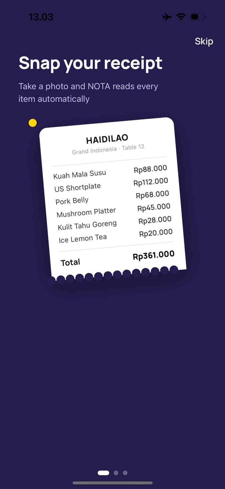
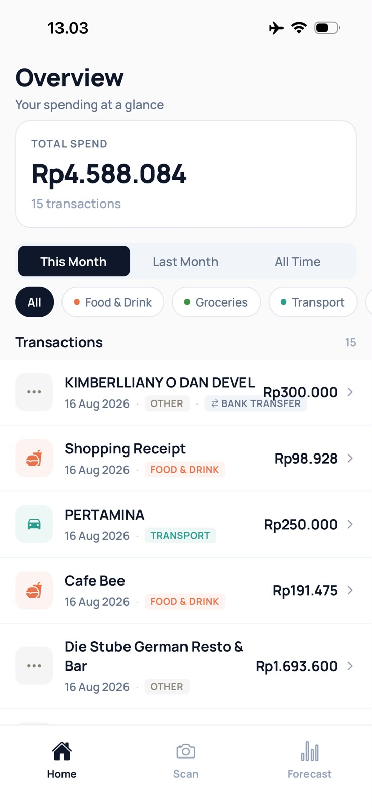
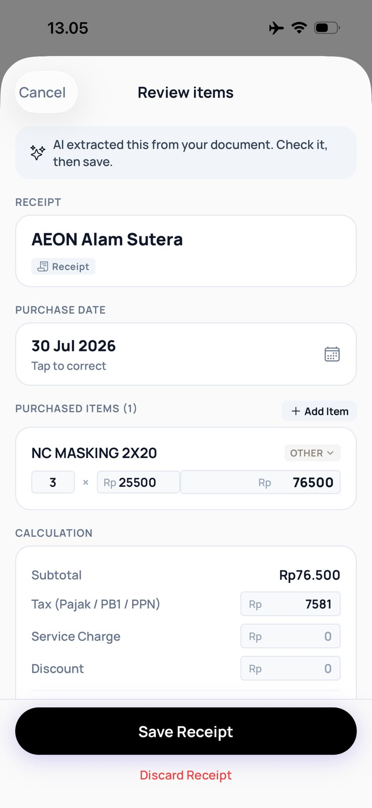
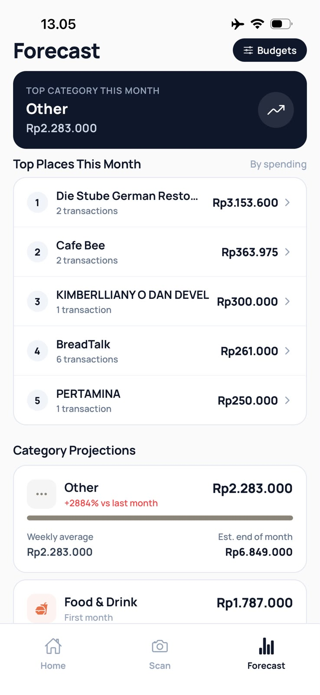

# NOTA — Personal Finance Journal

> A minimal, local-first personal finance app for Indonesia. Scan receipts, track spending, and see where your money actually goes — without the noise.


---

## Screenshots

| Onboarding | Home | Receipt Scan | Forecast |
|:---:|:---:|:---:|:---:|
|  |  |  |  |

---

## Overview

NOTA is built around one idea: **tracking your money should take less time than spending it.**

Most finance apps make you fill out forms. NOTA lets you point your camera at a receipt and it handles the rest — extracting merchant, items, amounts, and categories automatically using AI vision. Everything is stored locally on-device. No accounts, no cloud sync, no subscriptions.

---

## Features

**Receipt Scanner**
Point your camera at any Indonesian receipt. NOTA extracts every line item using AI, lets you review and correct before saving.

**Smart Categorization**
Transactions are automatically categorized (Food & Drink, Transport, Groceries, Bills, etc.) and can be corrected with a single tap.

**Monthly Forecast**
Based on your spending history, NOTA projects where you will end up at the end of the month per category.

**Budget Tracker**
Set monthly spending limits per category. See your progress without any charts or dashboards cluttering the view.

**Weekly Pulse**
A weekly editorial summary of what happened to your money. Calm, non-judgmental, and contextual.

**Bill & Subscription Tracker**
Log recurring expenses and get reminded when they are coming up.

---

## Tech Stack

| Layer | Technology |
|---|---|
| Framework | React Native + Expo SDK 57 |
| Language | TypeScript (strict mode) |
| Routing | Expo Router (file-based) |
| Database | `expo-sqlite` — 100% local, raw SQL |
| AI Vision | External vision API (receipt extraction) |
| Styling | React Native `StyleSheet` — zero UI libraries |

**Why local-first SQLite?**
The entire financial data pipeline runs on raw SQL queries — no ORM, no abstraction. This gives deterministic math (no floating point errors on Rupiah calculations), instant load times, and full offline support.

---

## Getting Started

### Prerequisites

- Node.js 18+
- [Expo Go](https://expo.dev/go) installed on your iPhone

### Installation

```bash
# Clone the repo
git clone https://github.com/darylrafael/NOTA.git
cd NOTA

# Install dependencies
# --legacy-peer-deps is required due to RN 0.76 strict peer resolution
npm install --legacy-peer-deps

# Start the dev server
npx expo start
```

Scan the QR code in your terminal with the iPhone Camera app, then open in Expo Go.

---

## Project Structure

```
NOTA/
├── app/              # Expo Router screens
│   ├── (tabs)/       # Tab navigator: Home, Scan, Forecast
│   ├── receipt/      # Receipt detail view
│   ├── review/       # Monthly review
│   └── settings.tsx  # Settings & data export
├── components/       # Reusable UI components
├── constants/        # Design tokens: colors, spacing, typography
├── db/               # SQLite schema, queries, seed scripts
├── lib/              # Business logic: formatting, math, date utils
├── types/            # Shared TypeScript types
└── docs/             # Architecture docs and screenshots
```

---

## Design Philosophy

NOTA's UI intentionally avoids generic component libraries. Every screen is built with React Native's `StyleSheet` API against a set of hand-crafted design tokens. The aesthetic is typography-led, whitespace-heavy, and inspired by Apple's own apps.

- **Local-first** — data lives on your device, responses are instant
- **Calm by default** — no badges, no anxiety-inducing dashboards
- **Explainable math** — every number is traceable to raw SQL, no black boxes
- **Built for Indonesia** — IDR formatting, local merchant patterns, Indonesian receipt structures

---

## License

MIT
