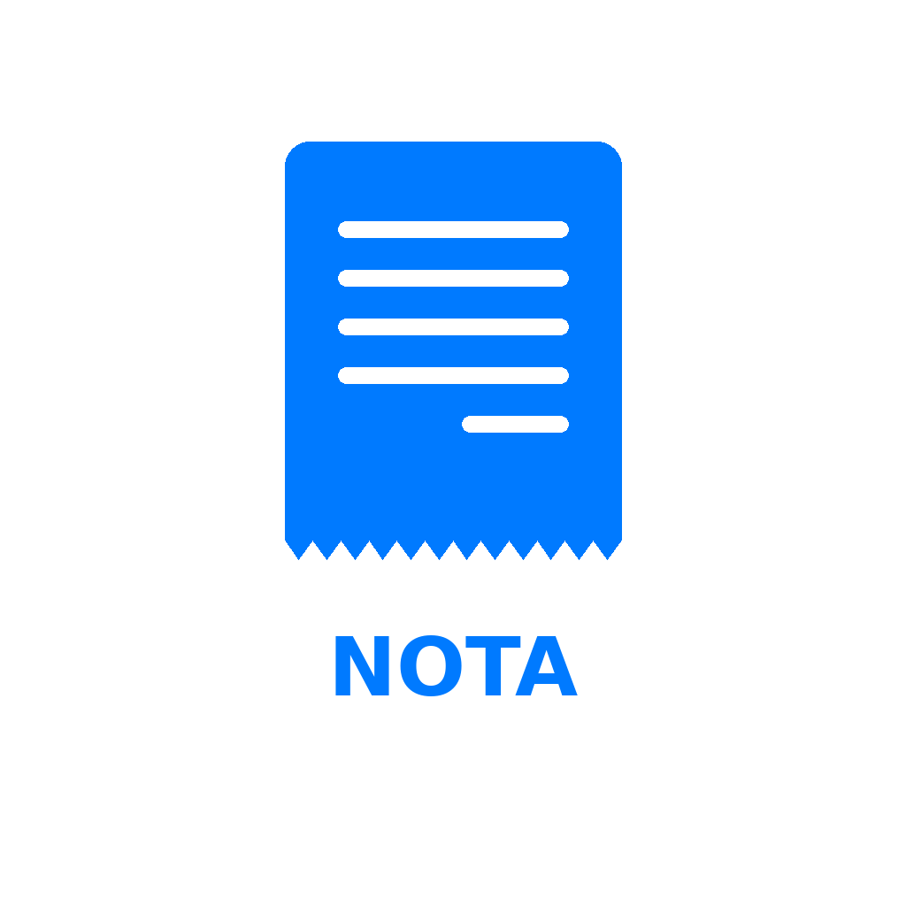
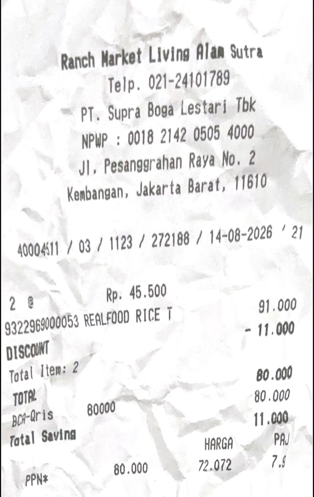
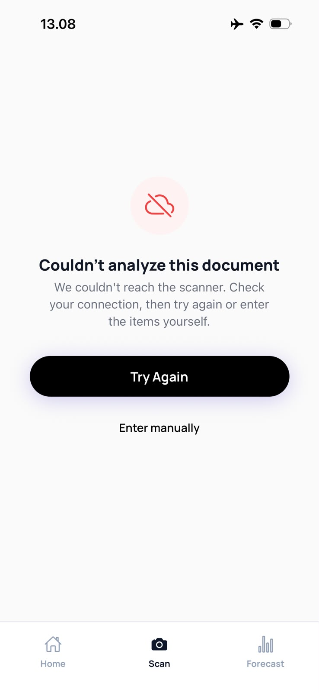

  
  <h1>NOTA</h1>
  
<strong>A minimal, local-first, iOS-native personal finance journal for Indonesia.</strong>

  

    
    
    
    
  

 

  
  
  

## ? Why NOTA?
Most finance apps are essentially noisy spreadsheets crammed with charts, gamification, and anxiety-inducing alerts. **NOTA is different.** It was engineered from the ground up to be a **calm financial journal**. 

By leveraging a 100% **Local-First SQLite** architecture, the app responds instantly. No loading spinners, no waiting for cloud syncs.

### Core Features
- ? **Lightning Fast (Local-First):** Data lives on your device. Instant state updates and offline capability.
- ?? **Typography-Led Design:** Custom iOS-native feel, Apple Card-inspired margins, and carefully crafted visual hierarchy. Zero generic UI libraries were used.
- ?? **Smart Insights & Forecast:** "Weekly Pulse" summaries, month-in-review editorial reports, and predictive spending forecasts.
- ?? **Subscription & Bills Tracker:** Keep tabs on recurring utility bills and upcoming subscriptions effortlessly.
- ???? **Tailored for Indonesia:** Designed specifically for IDR currency rules and local merchant patterns (e.g., Tokopedia, Gojek, Listrik).

---

## ?? Tech Stack

NOTA is a showcase of modern, pragmatic frontend engineering:

- **Framework:** [React Native](https://reactnative.dev/) & [Expo](https://expo.dev/) (SDK 57)
- **Language:** [TypeScript](https://www.typescriptlang.org/)
- **Database:** expo-sqlite (Raw SQL queries for maximum performance and deterministic math)
- **Routing:** Expo Router (File-based navigation)
- **Styling:** React Native StyleSheet (Strictly maintained design tokens, no bloated Tailwind/UI libs)

---

## ?? Getting Started

Follow these steps to run NOTA locally on your machine.

### Prerequisites
- Node.js (v18+)
- Expo CLI
- Expo Go app installed on your physical iOS device

### Installation

1. **Clone the repository**
   \\\ash
   git clone https://github.com/darylrafael/NOTA.git
   cd NOTA
   \\\

2. **Install dependencies**
   *(Note: Using --legacy-peer-deps is recommended due to React Native 0.86 strict peer dependencies).*
   \\\ash
   npm install --legacy-peer-deps
   \\\

3. **Start the development server**
   \\\ash
   npx expo start
   \\\

4. **Run on Device**
   Open the Camera app on your iPhone, scan the QR code presented in the terminal, and open it via **Expo Go**.

---

## ?? Seeding Demo Data

Want to see the app fully populated with realistic dummy data (specifically tailored to the Tangerang/BSD/GS areas)? 

1. Launch the app.
2. Tap the **Settings** icon (top right on the Home screen).
3. Scroll to **Data & Backup**.
4. Tap **"Inject Demo Data"**.
5. Restart or navigate to the Home screen to see the populated *Insights* and *History*.

---

## ?? Project Structure

\\\ash
NOTA/
+-- app/             # Expo Router screens (Home, Insights, Scan, Settings, Review)
+-- components/      # Reusable UI components (BottomSheet, Cards, Pills)
+-- constants/       # Centralized design tokens (colors, typography, spacing, categories)
+-- db/              # SQLite database schema, raw queries, and seeder scripts
+-- lib/             # Core business logic (deterministic math, date utilities, formatters)
+-- docs/            # Architecture reports, AI rules, and demo screenshots
+-- assets/          # Static application assets (icons, splash screens, fonts)
\\\

---

## ?? License

This project is licensed under the MIT License - see the [LICENSE](LICENSE) file for details.
